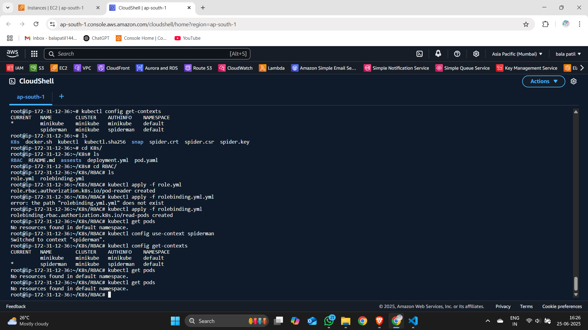
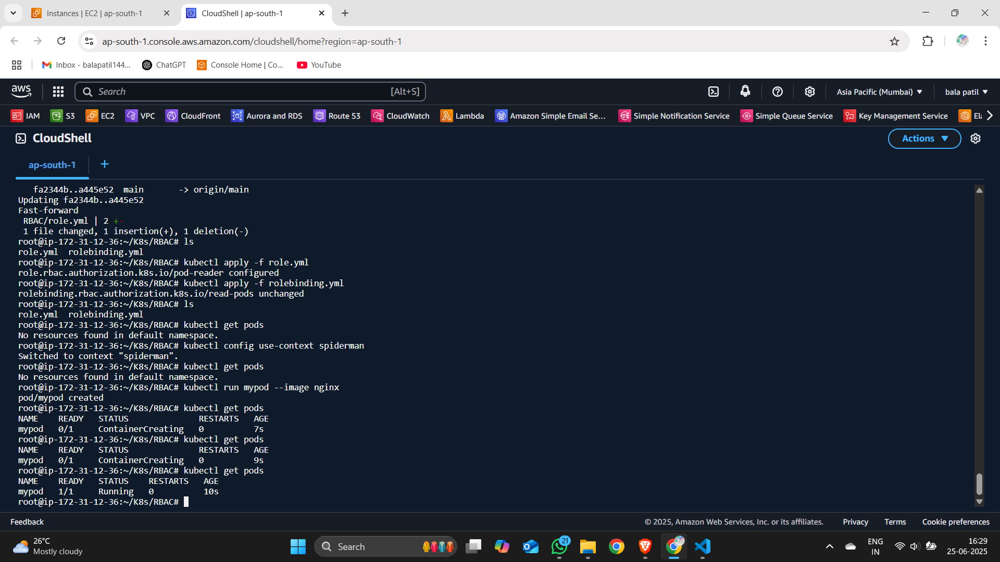

# K8s

**What is Kubernetes ?**

 - Kubernetes, also known as K8s, Kubernetes is an open-source container orchestration platform thatautomates the deployment, scaling, and management of containerized applications.

 - Developed by Google and now maintained by the Cloud Native Computing Foundation (CNCF) and released as open-source in 2014.

 - Kubernetes helps manage and organize containers automatically, ensuring that your containers keep running, can scale up when there's more traffic, and can move to healthy machines if something goes wrong.


🚀 **Why Use Kubernetes?**

Imagine you have an app running in a Docker container. Now, imagine you need to run 100 containers across 10 servers, handle failures, scale them up/down, manage load balancing, and update them without downtime. That's where Kubernetes shines.

<hr>

🧱 **Kubernetes Core Concepts**

1. *Cluster* - Cluster is group of master node and worker node
  - Master Node (Control Plane) – brain of the cluster, manages everything.
  - Worker Nodes – where your containers actually run.

2. *Pod* - The smallest unit in Kubernetes.
  - A pod can contain one or more tightly coupled containers.
  - All containers in a pod share networking and storage.

3. *Node*
 - A physical or virtual machine that runs your applications (pods).
 - Every node has a Kubelet (agent), container runtime (like Docker/Containerd), and Kube-proxy.

4. *Deployment*
 - Manages the desired state for your pods (e.g., number of replicas).
 - Handles updates, rollbacks, and ensures the app stays healthy.

5. *Service* - Provides a stable IP and DNS name to a set of pods. <br>
 *Types:*
   - ClusterIP (default) – for internal communication.
   - NodePort – exposes service on a static port on each node.
   - LoadBalancer – exposes service externally via cloud load balancer.

6. *Namespace*
 - Used to logically separate resources in the same cluster (multi-team or multi-project setup).

<hr>


⚙️ Kubernetes Control Plane Components: 

🔹 *1. API-SERVER*

📌 Role: Frontend to Kubernetes. All requests go through this. 
- The API Server is the gateway to the Kubernetes cluster.
- All communication to and from the control plane happens through the API Server using RESTful APIs.
- Validates and processes REST requests (like creating pods, services, etc.).
- Stores the state of the cluster in etcd.
- All kubectl, controller manager, scheduler, and other control plane components interact with the API Server.

Key Points:
   - Stateless and scalable (you can run multiple instances).
   - Communicates using JSON over HTTP.
   - Implements authentication, authorization, and admission control.


 🔹 *2. Scheduler*
 
 📌 Role: Assigns pods to suitable nodes based on resource requirements. <br>
 -  Watches for newly created pods that don’t have a node assigned.  <br>
 - Selects the best node for the pod based on:
   - Resource requirements (CPU, memory, etc.)
   - Node taints and tolerations
   - Node selectors
   - Pod topology constraints

  Key Points:
   - Doesn’t actually launch pods — just decides where they should go.
   - Scheduling decisions are written back to the API Server.

 🔹 *3. Controller-Manager* 
 
📌 Role: Runs multiple background controllers
A controller is a control loop that watches the cluster state via the API Server and makes changes to move the current state toward the desired state.

Common Controllers:
 - Node Controller – Detects node failures and manages node lifecycle.
 - Replication Controller / ReplicaSet Controller – Ensures desired number of pod replicas.
 - Deployment Controller – Manages rolling updates and rollbacks.
 - Job Controller – Manages one-time or batch jobs.
 - Service Account & Token Controllers – Manages default accounts and tokens.

Key Points:
 - All these controllers are compiled into a single binary (kube-controller-manager).
 - Communicates only with the API Server.

🔹 *4. etcd*

📌 Role: Distributed key-value store for storing cluster data/configuration.
 - Acts as the single source of truth for the cluster.
 - Stores all configuration data, state, and metadata of the cluster.
 - Used by the API Server to read and persist the state of all Kubernetes objects.

Key Points:
   - available and consistent (uses the Raft consensus algorithm).
   - Back up regularly — loss of etcd data can be catastrophic.
   - Only directly accessed by the API server (other components go through API server).

<hr>

 🔧 Components of Worker Node:
 
 *1. Kubelet*
 - Talks to the API server on the control plane.
 - Receives PodSpecs and ensures the containers described are running and healthy.
 - Monitors the state of the pods and reports back to the control plane.   <br>
📌 Think of it as the node-level manager for containers.

*2. Container Runtime*
 - Responsible for pulling container images, starting, stopping, and managing container lifecycles.
 - Common runtimes:
   - containerd (default for modern K8s)
   - CRI-O
   - Docker (deprecated as of K8s v1.24+)  <br>
📌 Kubernetes uses a Container Runtime Interface (CRI) to talk to these runtimes.

*3. Kube-Proxy*
 - Handles networking for services.
 - Maintains iptables or IPVS rules to route traffic to appropriate pods.
 - Ensures that each service is accessible using its ClusterIP or NodePort.  <br>
📌 This is what allows your app to be reachable internally or externally.

*4. Pods*
 - Actual execution units that run your app containers.
 - Each pod:
   - Has its own IP address.
   - Shares storage volumes (if configured).
   - Shares the same network namespace across containers inside the pod.

🔄 **How They All Work Together**

 - Kubelet asks the API Server if there are any pods scheduled to this node.
 - If there are, it pulls the container images using the container runtime.
 - The pod is created, and the Kubelet continuously monitors its health.
 - Kube-Proxy sets up networking so other services or pods can talk to this pod.

<hr>

**WorkFlow of Kubernetes Architecture :**

✅ 1. User Sends a Request
 - You use kubectl (CLI) or UI to deploy an app.
 - Example: "Create a pod or deploy an app."

✅ 2. API Server Receives It
 - API Server is the gatekeeper.
 - It checks if the request is valid and stores it in the system.

✅ 3. Data is Stored in etcd
 - etcd saves the desired state of the cluster (what you want to happen).

✅ 4. Scheduler Finds a Node
 - Scheduler checks: “Where should this pod run?”
 - It picks the best worker node and updates the plan.

✅ 5. Controller Manager Watches
 - It makes sure your request actually happens.
 - If something is missing (like a pod), it tells the API Server to fix it.

✅ 6. Kubelet on Worker Node Acts
 - Kubelet (on the chosen node) gets the pod info from the API Server.
 - It asks Docker to run the container inside a pod.

✅ 7. Docker Runs Containers
 - Docker (or another runtime) downloads images and starts containers inside pods.

✅ 8. Kube-proxy Manages Network
 - It sets up the network rules so:
 - Pods can talk to each other.
 - Services can talk to pods.
 - External users can access your app.

✅ 9. Continuous Monitoring
 - If something goes wrong (e.g., pod crashes or node fails):
 - Controllers reschedule or restart pods.
 - Kubelet keeps reporting health.

🔁 Cluster Keeps Running Automatically
 - The system self-heals and always tries to match the desired state.

<hr>
Kubernetes objects:

Kubernetes objects define and manage the state of your cluster, controlling how applications run, how they comminucate, and how they store data.

1. Workload Objects

   1.1 Pod
    - Smallest and simplest unit in Kubernetes.
    - Represents one or more containers that share storage, network, and a specification for how to run.
    - Usually runs one application container.

   1.2 Deployment
    - Manages ReplicaSets and Pods.
    - Supports rolling updates, rollbacks, and more.
    - Most commonly used object for managing apps.
  
   1.3 StatefulSet
    - Manages stateful applications like databases.
    - Each Pod has a stable identity and persistent storage.
  
   1.4 DaemonSet
    - Ensures a copy of a Pod runs on every node (or specific nodes).
    - Used for log collection, monitoring agents, etc.
  
   1.5 Job and CronJob
    - Job: runs a task once until complete.
    - CronJob: runs scheduled jobs (like a cron task).


2. Networking Objects

   2.1 Service
    - Exposes your Pods to other services or external traffic.
    - Types:
      - ClusterIP: internal access only.
      - NodePort: exposes via port on each Node.
      - LoadBalancer: uses cloud provider’s LB.
      - ExternalName: maps to external DNS.

   2.2 Ingress
    - Manages external access to Services, typically HTTP/HTTPS.
    - Acts like a reverse proxy with routing rules.
    - Requires an Ingress Controller (e.g., NGINX, Traefik).
  
   2.3 NetworkPolicy
    - Controls network traffic between Pods.
    - Implements firewall-like rules.
    - You must use a network plugin that supports policies (like Calico).


3. Storage Objects

   3.1 PersistentVolume (PV)
    - Represents actual storage in the cluster (e.g., disk, NFS, cloud volume).
    - Created by admins or dynamic provisioners.
    - Independent of any specific Pod.

   3.2 PersistentVolumeClaim (PVC)
    - Request for storage by a user.
    - Binds to a matching PV.
    - Pods use PVCs to get storage without worrying about underlying details.
  
   3.3 ConfigMap
    - Stores configuration data (non-sensitive).
    - Can be injected into Pods as environment variables or volumes.
  
   3.4 Secret
    - Stores sensitive data like passwords, tokens, keys.
    - Data is base64 encoded.


4. Cluster Management Object

   4.1 Namespace
    - Used to divide cluster resources logically (like virtual clusters).
    - Helps isolate teams, environments (dev, test, prod), or projects.

   4.2 ResourceQuota
    - Limits the amount of resources (CPU, memory, storage) a namespace can use.
    - Helps prevent a team/project from consuming all cluster resources.
  
   4.3 LimitRange
    - Sets default and maximum resource limits for containers in a namespace.
    - Prevents overuse of resources by individual pods.


<hr>
RBAC :
<hr>

RBAC - Role Based Access Control

 - Kubernetes RBAC is a key security control to ensure that cluster users and workloads have only the access to resources required to execute their roles.
 - RBAC (Role-Based Access Control) is a security mechanism that restricts what users or service accounts can do in your Kubernetes cluster.

```ssh
apiVersion: rbac.authorization.k8s.io/v1
```

It lets you control access based on:  <br>
 - Who (user, group, service account)
 - Can do what (verbs like get, list, create)
 - On what (resources like pods, deployments)
 - Where (namespaces or cluster-wide)

🎯 Why Use RBAC? <br>
 - Protect your cluster from unauthorized access
 - Enforce least-privilege access
 - Separate team access (e.g., devs, ops, CI/CD)


🔑 Authentication vs Authorization: <br>

```ssh
| Concept            | Authentication 🔐                      | Authorization 🛡️                       |
| ------------------ | --------------------------------------  | --------------------------------------- |
|  What is it?       | Verifying who you are                   | Verifying what you're allowed to do     |
|  Answer to?        | “Are you really `spiderman`?”           | “Can `spiderman` list pods?”            |
|  Happens first?    | ✅ Yes                                  | ➡️ Only after successful authentication |
|  Mechanisms        | Certificates, tokens, passwords         | RBAC, ABAC, policies                    |
|  K8s Example       | TLS client certificate proves identity  | RBAC RoleBinding grants pod access      |
|  Failure case      | ❌ You’re treated as `system:anonymous` | ❌ You’re told: "pods is forbidden..."   |
```

<hr>

**Create a client certificate**

1. Generate a private key using OpenSSL:
```ssh
openssl genrsa -out spider.key 2048
```

2. Generate a Client Sign Request (CSR):
```ssh
openssl req -new -key spider.key -out spider.csr
```

3. Generate the certificate(CRT)
```ssh
openssl x509 -req -in spider.csr -CA ~/.minikube/ca.crt -CAkey ~/.minikube/ca.key -CAcreateserial -out spider.crt -days 365
```

<hr>

**Create a user**

4. Set a user entry in kubeconfig
```ssh
kubectl config set-credentials spiderman --client-certificate=spider.crt --client-key=spider.key
```

5. Set a context entry in kubeconfig
```ssh
kubectl config set-context spiderman --cluster=minikube --user=spiderman --namespace=default
```

<hr>

Check that it is successfully added to kubeconfig:
```ssh
kubectl config view
```

Check present users:
```ssh
kubectl config get-users
```

Check current user
```ssh
kubectl config get-contexts
```

<hr>

**Switch User**

6. Switching to the spiderman user:
```ssh
kubectl config use-context spiderman
```

<hr>

**Grant access to the user**

7. Create a Role

role.yml:
```ssh
apiVersion: rbac.authorization.k8s.io/v1
kind: Role
metadata:
  namespace: default
  name: pod-reader
rules:
- apiGroups: [""]
  resources: ["pods"]
  verbs: ["get", "watch", "list"]
```

"In the above Role, if we attach it to a user, that user can only perform get, watch, and list actions on pods."


8. Create a BindingRole

rolebinding.yml:
```ssh
apiVersion: rbac.authorization.k8s.io/v1
kind: RoleBinding
metadata:
  name: read-pods
  namespace: default
subjects:
- kind: User
  name: spiderman 
  apiGroup: rbac.authorization.k8s.io
roleRef:
  kind: Role 
  name: pod-reader
  apiGroup: rbac.authorization.k8s.io
```

Deploy both the role.yaml and role-binding.yaml

```ssh
kubectl apply -f role.yml
kubectl apply -f rolebinding.yml
```

<hr>

9. Test using spiderman user

Check spiderman user can list pods or not and check with non allowed permissions






<hr>
Helm Chart : 
<hr>

**Helm Chart :**  <br>
A Helm Chart is a package manager format for Kubernetes. Think of it like apt for Ubuntu or yum for CentOS — but for Kubernetes applications.

These charts combine YAML files and templates to create configuration files based on specific parameters, allowing for customization for different environments and reuse across multiple deployments.

🚀 **Why Use Helm?**

 - Kubernetes manifests (YAML files) can become complex when deploying large apps. Helm solves this by:
 - Grouping Kubernetes manifests into a single package (Chart).
 - Allowing templating, so you can reuse and customize configs.
 - Managing versioning, rollbacks, and releases easily.


🧱 **Helm Chart Components**  <br>
A Helm chart is a directory structure that looks like:

```ssh
mychart/
├── Chart.yaml          # Metadata about the chart
├── values.yaml         # Default values for the templates
├── templates/          # YAML templates for Kubernetes resources
│   ├── deployment.yaml
│   ├── service.yaml
│   └── ...
├── charts/             # Subcharts (dependencies)
└── README.md           # Optional documentation
```

*Helm Installation for ubuntu :*

1. select package:
 
```ssh
curl -O https://get.helm.sh/helm-v3.18.3-linux-amd64.tar.gz
```

2. unzip the package:

```ssh
tar -xzvf tar -zxvf helm-v3.18.3-linux-amd64.tar.gz
```

3. find the helm binary in the unpacked directory, and move it to its desired destination

```ssh
mv linux-amd64/helm /usr/local/bin/helm
```

4. check

```ssh
helm version
```

<hr>

Initialize Helm Chart Repository:

```ssh
helm repo add bitnami https://charts.bitnami.com/bitnami
```

```ssh
helm repo update
```

```ssh
helm install bitnami/mysql --generate-name
```

```ssh
helm install bitnami/nginx --generate-name
```

list installations:

```ssh
helm list
```

Uninstall a Release:

```ssh
helm uninstall <release-id>
```

Check Status:

```ssh
helm status <release-id>
