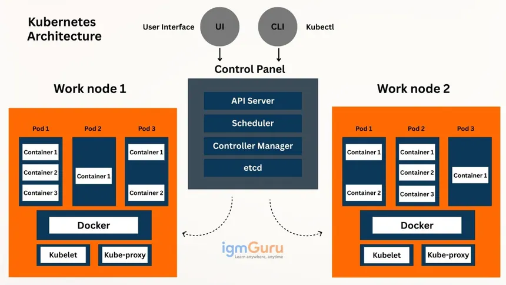

# K8s

**What is Kubernetes ?**

 - Kubernetes, also known as K8s, Kubernetes is an open-source container orchestration platform thatautomates the deployment, scaling, and management of containerized applications.

 - Developed by Google and now maintained by the Cloud Native Computing Foundation (CNCF) and released as open-source in 2014.

 - Kubernetes helps manage and organize containers automatically, ensuring that your containers keep running, can scale up when there's more traffic, and can move to healthy machines if something goes wrong.

🚀 **Why Use Kubernetes?**

Imagine you have an app running in a Docker container. Now, imagine you need to run 100 containers across 10 servers, handle failures, scale them up/down, manage load balancing, and update them without downtime. That's where Kubernetes shines.

🧱 **Kubernetes Core Concepts**

1. *Cluster* - Cluster is group of master node and worker node
  - Master Node (Control Plane) – brain of the cluster, manages everything.
  - Worker Nodes – where your containers actually run.

2. *Pod* - The smallest unit in Kubernetes.
  - A pod can contain one or more tightly coupled containers.
  - All containers in a pod share networking and storage.

3. *Node*
 - A physical or virtual machine that runs your applications (pods).
 - Every node has a Kubelet (agent), container runtime (like Docker/Containerd), and Kube-proxy.

4. *Deployment*
 - Manages the desired state for your pods (e.g., number of replicas).
 - Handles updates, rollbacks, and ensures the app stays healthy.

5. *Service* - Provides a stable IP and DNS name to a set of pods.  
 *Types:*
   - ClusterIP (default) – for internal communication.
   - NodePort – exposes service on a static port on each node.
   - LoadBalancer – exposes service externally via cloud load balancer.

6. *Namespace*
 - Used to logically separate resources in the same cluster (multi-team or multi-project setup).

⚙️ Kubernetes Control Plane Components: 

🔹 *1. API-SERVER*

📌 Role: Frontend to Kubernetes. All requests go through this. 
- The API Server is the gateway to the Kubernetes cluster.
- All communication to and from the control plane happens through the API Server using RESTful APIs.
- Validates and processes REST requests (like creating pods, services, etc.).
- Stores the state of the cluster in etcd.
- All kubectl, controller manager, scheduler, and other control plane components interact with the API Server.

Key Points:
   - Stateless and scalable (you can run multiple instances).
   - Communicates using JSON over HTTP.
   - Implements authentication, authorization, and admission control.

 🔹 *2. Scheduler*
 
 📌 Role: Assigns pods to suitable nodes based on resource requirements.  
 -  Watches for newly created pods that don’t have a node assigned.   
 - Selects the best node for the pod based on:
   - Resource requirements (CPU, memory, etc.)
   - Node taints and tolerations
   - Node selectors
   - Pod topology constraints

  Key Points:
   - Doesn’t actually launch pods — just decides where they should go.
   - Scheduling decisions are written back to the API Server.

 🔹 *3. Controller-Manager* 
 
📌 Role: Runs multiple background controllers
A controller is a control loop that watches the cluster state via the API Server and makes changes to move the current state toward the desired state.

Common Controllers:
 - Node Controller – Detects node failures and manages node lifecycle.
 - Replication Controller / ReplicaSet Controller – Ensures desired number of pod replicas.
 - Deployment Controller – Manages rolling updates and rollbacks.
 - Job Controller – Manages one-time or batch jobs.
 - Service Account & Token Controllers – Manages default accounts and tokens.

Key Points:
 - All these controllers are compiled into a single binary (kube-controller-manager).
 - Communicates only with the API Server.

🔹 *4. etcd*

📌 Role: Distributed key-value store for storing cluster data/configuration.
 - Acts as the single source of truth for the cluster.
 - Stores all configuration data, state, and metadata of the cluster.
 - Used by the API Server to read and persist the state of all Kubernetes objects.

Key Points:
   - available and consistent (uses the Raft consensus algorithm).
   - Back up regularly — loss of etcd data can be catastrophic.
   - Only directly accessed by the API server (other components go through API server).

 🔧 Components of Worker Node:
 
 *1. Kubelet*
 - Talks to the API server on the control plane.
 - Receives PodSpecs and ensures the containers described are running and healthy.
 - Monitors the state of the pods and reports back to the control plane.    
📌 Think of it as the node-level manager for containers.

*2. Container Runtime*
 - Responsible for pulling container images, starting, stopping, and managing container lifecycles.
 - Common runtimes:
   - containerd (default for modern K8s)
   - CRI-O
   - Docker (deprecated as of K8s v1.24+)   
📌 Kubernetes uses a Container Runtime Interface (CRI) to talk to these runtimes.

*3. Kube-Proxy*
 - Handles networking for services.
 - Maintains iptables or IPVS rules to route traffic to appropriate pods.
 - Ensures that each service is accessible using its ClusterIP or NodePort.   
📌 This is what allows your app to be reachable internally or externally.

*4. Pods*
 - Actual execution units that run your app containers.
 - Each pod:
   - Has its own IP address.
   - Shares storage volumes (if configured).
   - Shares the same network namespace across containers inside the pod.

🔄 **How They All Work Together**

 - Kubelet asks the API Server if there are any pods scheduled to this node.
 - If there are, it pulls the container images using the container runtime.
 - The pod is created, and the Kubelet continuously monitors its health.
 - Kube-Proxy sets up networking so other services or pods can talk to this pod.

**WorkFlow of Kubernetes Architecture :**

✅ 1. User Sends a Request
 - You use kubectl (CLI) or UI to deploy an app.
 - Example: "Create a pod or deploy an app."

✅ 2. API Server Receives It
 - API Server is the gatekeeper.
 - It checks if the request is valid and stores it in the system.

✅ 3. Data is Stored in etcd
 - etcd saves the desired state of the cluster (what you want to happen).

✅ 4. Scheduler Finds a Node
 - Scheduler checks: “Where should this pod run?”
 - It picks the best worker node and updates the plan.

✅ 5. Controller Manager Watches
 - It makes sure your request actually happens.
 - If something is missing (like a pod), it tells the API Server to fix it.

✅ 6. Kubelet on Worker Node Acts
 - Kubelet (on the chosen node) gets the pod info from the API Server.
 - It asks Docker to run the container inside a pod.

✅ 7. Docker Runs Containers
 - Docker (or another runtime) downloads images and starts containers inside pods.

✅ 8. Kube-proxy Manages Network
 - It sets up the network rules so:
 - Pods can talk to each other.
 - Services can talk to pods.
 - External users can access your app.

✅ 9. Continuous Monitoring
 - If something goes wrong (e.g., pod crashes or node fails):
 - Controllers reschedule or restart pods.
 - Kubelet keeps reporting health.

🔁 Cluster Keeps Running Automatically
 - The system self-heals and always tries to match the desired state.
